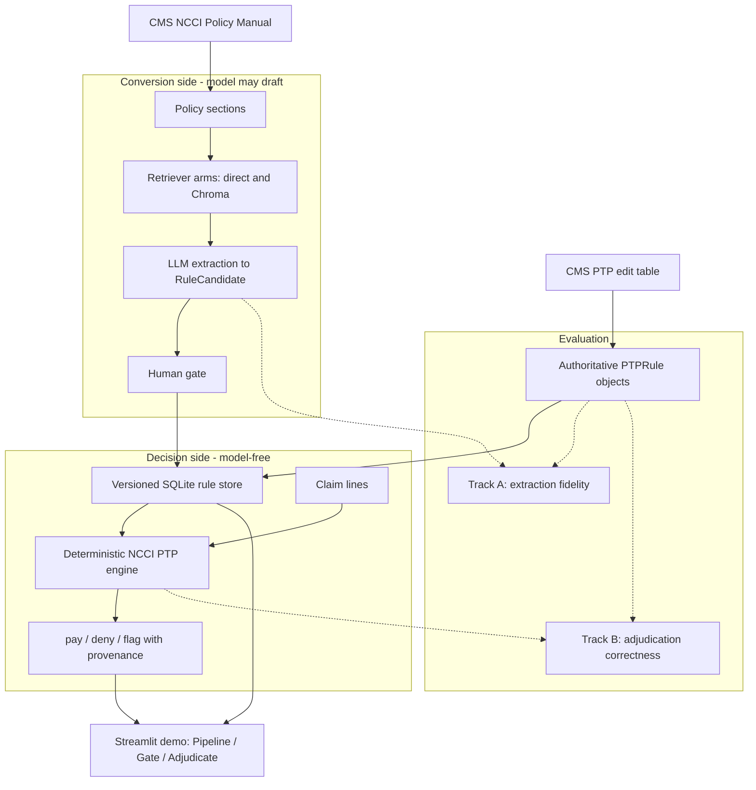

# PolicyForge

**Converting written health-care policy into auditable, executable claim edits.**

PolicyForge is a proof of concept for Cotiviti Intern Assessment Topic 3,
Content Management in Health Care. It demonstrates a conservative architecture
for turning CMS NCCI policy into payment-edit logic: a language model can draft
structured rule candidates, but only a human-gated, deterministic rules engine
can decide a claim.

The thesis is simple: **LLMs draft rules; humans approve the rule store; a
deterministic engine adjudicates.**

## The Concept

Health care runs on written policy: billing manuals, coding guidance, clinical
guidelines, and payer-provider contracts. These documents are written for human
readers, but the payment and care decisions that depend on them must run at
machine scale, consistently and defensibly.

The concrete target here is the CMS National Correct Coding Initiative (NCCI)
Procedure-to-Procedure (PTP) edit program. NCCI publishes both:

- a structured PTP edit table, which identifies code pairs and their Correct
  Coding Modifier Indicator (CCMI); and
- a policy manual, which explains coding principles and includes some explicit
  examples in prose.

The hard part is not merely extracting text. The hard part is converting policy
into executable artifacts without losing the audit trail a payment-integrity
reviewer, provider appeal, or regulator would require.

## The Solution

PolicyForge separates conversion from adjudication with a deliberate boundary:
the seam.

```text
policy text -> LLM draft RuleCandidate
                  |
                  v
             human gate
        approve / reject / correct CCMI
                  |
                  v
         versioned rule store
                  |
                  v
       deterministic engine decides
                  |
                  v
   cited disposition: rule id + ruleset version
```

The model may convert policy prose into a draft. It may not decide payment. A
draft `RuleCandidate` becomes an executable `PTPRule` only after human review,
schema validation, and persistence in the versioned store. The adjudication path
uses no Anthropic SDK, embeddings, Chroma retrieval, model output, or randomness.

Every deny or flag line cites the `rule_id` and `ruleset_version` that produced
it.

## Architecture



## Proof of Concept

PolicyForge implements the full seam end to end:

- ingests the CMS Practitioner PTP edit table into validated `PTPRule` objects;
- loads the NCCI Policy Manual into chapter-keyed policy sections;
- retrieves relevant policy text with a direct lexical control arm and an
  optional Chroma vector-search treatment arm;
- uses an LLM only to draft `RuleCandidate` objects grounded to source chapter,
  source quote, and confidence;
- routes candidates through a human gate where a reviewer can approve, reject,
  or correct the stored CCMI before approval;
- persists authoritative and human-gated rules in a versioned SQLite store with
  provenance;
- adjudicates synthetic claims with a deterministic NCCI PTP engine; and
- reports extraction and adjudication results separately so the demo does not
  hide model limitations behind a single score.

The default demo pair is `11042 / 97597`. The Adjudicate tab can run offline from
the bundled fixture and shows the deterministic disposition plus rule provenance.

## What Evaluators Should Notice

The most important design choice is what PolicyForge does **not** do. It does not
ask an LLM whether to pay or deny a line. It does not let an unapproved candidate
reach adjudication. It does not report extraction fidelity and adjudication
correctness as one blended metric.

Instead, it treats the model as a conversion aid, the human as the approval gate,
the schemas as the contract, and the deterministic engine as the only decision
maker.

## Setup Instructions

Use Python 3.11 or newer.

```bash
make install
```

Run the core checks:

```bash
make test
make lint
```

The automated test suite is fully offline. It does not require CMS data, an
Anthropic key, Ollama, Chroma, or network access.

## Optional Data and Live Extraction

CMS/CPT source data is licensed and is not committed to this repository. To run
the real-data paths, run:

```bash
make fetch-data
```

That target prints the official CMS download locations. Download and extract the
files under `data/`.

For live LLM extraction, copy `env.example` to `.env` and fill in the relevant
values:

```text
ANTHROPIC_API_KEY=...
POLICYFORGE_EXTRACTION_MODEL=claude-sonnet-4-6
POLICYFORGE_EMBEDDING_MODEL=nomic-embed-text
POLICYFORGE_OLLAMA_BASE_URL=http://localhost:11434
```

`ANTHROPIC_API_KEY` enables live extraction. `POLICYFORGE_EMBEDDING_MODEL`
enables the optional Chroma treatment arm through a local Ollama embedding model.

## Run the Demo

```bash
make demo
```

Streamlit prints a local URL, usually `http://localhost:8501`.

The demo has three views:

- **Pipeline** retrieves policy text and, when `ANTHROPIC_API_KEY` is configured,
  extracts draft `RuleCandidate` objects.
- **Gate** lets a reviewer inspect a candidate, approve it, reject it, or correct
  the CCMI that will be stored.
- **Adjudicate** seeds the canonical demo pair if needed, runs the deterministic
  engine, and displays disposition provenance.

With no CMS data and no API key, the Adjudicate tab still works from
`fixtures/sample_ptp.csv`. With CMS data and an Anthropic key, the Pipeline and
Gate tabs exercise the live conversion path.

## Testing Instructions

```bash
make test
```

Runs the hermetic behavioral suite: schemas, ingestion, retriever arms,
extraction parsing, deterministic engine scenarios, evaluation metrics, gate and
store behavior, and orchestration.

```bash
make lint
```

Runs Ruff over `policyforge` and `tests`.

```bash
make eval
```

Runs the evaluation harness. This path needs the real gold set under `data/`.
Evaluation is reported in two tracks:

- **Track A - extraction fidelity.** Scores drafted `RuleCandidate` objects
  against authoritative PTP rules. Recall over the full table is expected to be
  low because the manual often states principles rather than explicit code
  pairs; the useful number is recall over the extractable subset.
- **Track B - adjudication correctness.** Scores deterministic claim
  dispositions against expected `pay` / `deny` / `flag` outcomes. This is the
  payment-logic proof point.

## Project Map

| Path | Role |
| --- | --- |
| `policyforge/schemas.py` | Pydantic contracts and shared data shapes |
| `policyforge/ingestion.py` | CMS PTP table and policy manual loading |
| `policyforge/retriever.py` | Direct retrieval and optional Chroma vector retrieval |
| `policyforge/extraction.py` | LLM-backed `RuleCandidate` extraction |
| `policyforge/gate.py` | Human review gate for approving or rejecting candidates |
| `policyforge/store.py` | Versioned SQLite rule store with provenance |
| `policyforge/engine.py` | Deterministic NCCI PTP adjudication engine |
| `policyforge/evaluation/run_eval.py` | Track A and Track B evaluation harness |
| `policyforge/orchestration.py` | LangGraph demo orchestration |
| `app/main.py` | Streamlit demo UI |
| `tests/` | Behavioral test suite |

## Scope

In scope:

- CMS NCCI Practitioner PTP edits;
- CCMI `0`, `1`, and `9` behavior;
- provenance for rules, candidates, and non-pay dispositions;
- direct-vs-vector retrieval comparison; and
- a proof-oriented Streamlit demo.

Out of scope:

- MUE unit-cap edits;
- real claims, PHI, payer integration, auth, or deployment;
- fine-tuning or model training; and
- allowing a model to adjudicate payment.

## Related Documents

- `Written_Report.docx` - assessment report and strategic framing
- `PolicyForge.pptx` - presentation deck
- `setup-and-test.md` - detailed setup and manual verification guide
- `SPEC.md` - project contract and definitions of done
- `PLAN.md` - phase-by-phase implementation plan and review outcomes
- `DECISIONS.md` - ADR-style engineering decision log
