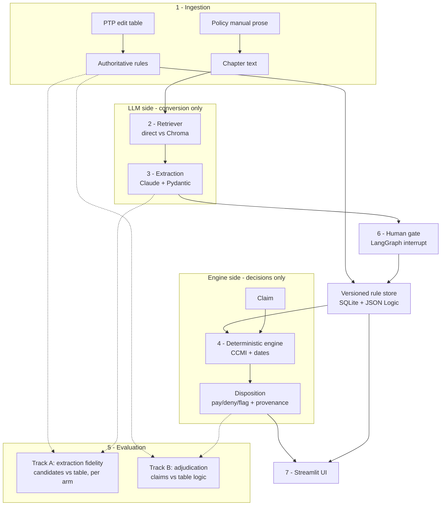
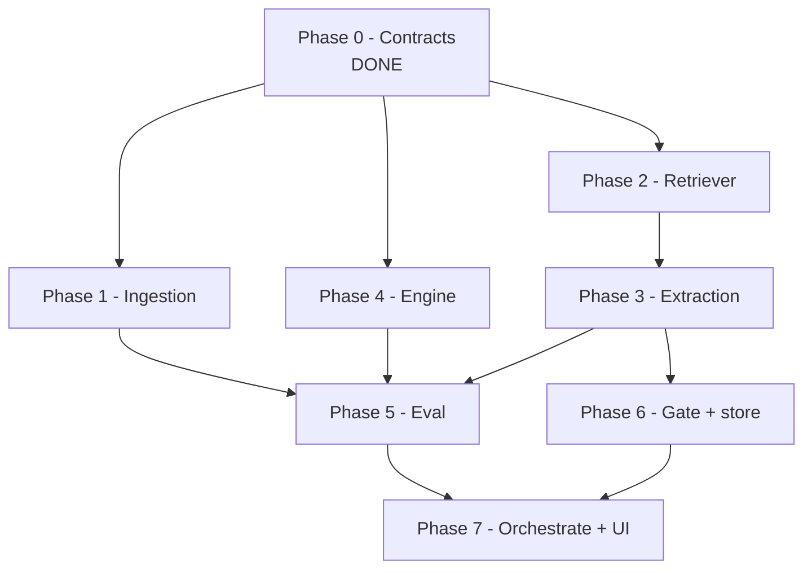
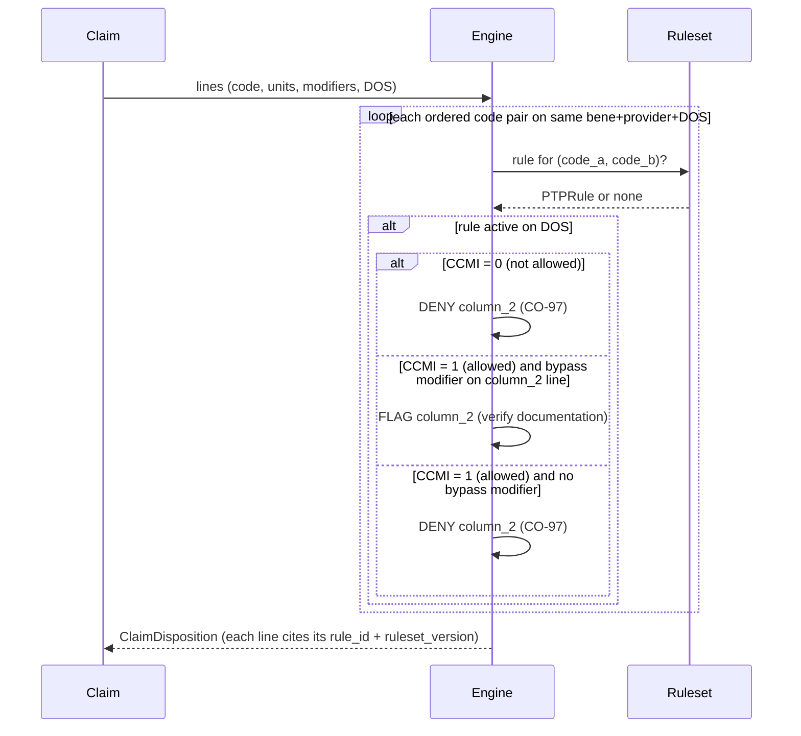
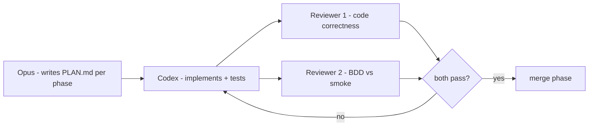

# PolicyForge — SPEC

> Convert written CMS payment policy into auditable, executable claim edits.
> This file is the contract between the human, the planning agent, the coding agent,
> and the review agents. If reality and SPEC disagree, fix one of them — never let
> them drift silently.

## 1. Mission

Take CMS NCCI policy — the prose **Policy Manual** and the published **PTP edit
table** — and:

1. Use an LLM to **convert** policy prose into structured rule candidates.
2. Gate every candidate through a **human** before it becomes a live rule.
3. Compile the authoritative table into a **deterministic engine** that adjudicates
   claims to `pay` / `deny` / `flag`, each decision citing the rule that caused it.
4. **Measure** the LLM's conversion fidelity against the table (ground truth), and
   the engine's correctness against the table + modifier logic.

The thesis, in one line: **LLMs draft rules, a deterministic engine enforces them,
a human gates the diff.**

## 2. Scope

**In scope**
- NCCI **Practitioner** PTP edits (Column 1 / Column 2 / CCMI 0·1·9).
- Policy Manual prose where it names concrete code pairs (the eval-able subset).
- Two retrieval arms for an ablation: direct chapter injection vs ChromaDB.
- One human-gated, versioned rule store.
- Streamlit demo over a handful of real code pairs.

**Out of scope (do not build)**
- MUE unit-cap edits (mention in the report as the natural next ruleset; no code).
- Principle-level manual guidance that names no codes.
- Real claims data, PHI, or any payer integration.
- Auth, multi-user, deployment, horizontal scaling.
- Fine-tuning or training any model.

If a task tempts you outside this list, stop and flag it. Scope creep is the
primary risk to this build, not difficulty.

## 3. Runtime architecture

The two halves never touch except through the **human gate** and the **rule store**.
The LLM is structurally barred from the decision path.

## 4. Build-phase dependency graph

Critical path: `0 → 2 → 3 → 5 → 7`. Phases 1 and 4 run in parallel off Phase 0 and
do not block the critical path — schedule them first. Phase 4 unlocks Track B, the
un-fakeable proof, so get it green early.

## 5. Adjudication sequence (Phase 4, the heart)

## 6. Sprint plan — phases, definitions of done

Each phase is one PLAN.md unit. **Definition of done = the named `make` target is
green AND the review agents sign off on both code and tests.**

| Phase | Objective | Key interface | DoD |
|---|---|---|---|
| 0 ✅ | Contracts + scaffold | `policyforge.schemas`, `policyforge.retriever` | `make test` green (done) |
| 1 | Ingest table + manual | `load_ptp_table() -> list[PTPRule]`, `load_policy_sections() -> dict[str,str]` | known pair present; counts match; CCMI ∈ {0,1,9} |
| 4 | Deterministic engine | `adjudicate(claim, ruleset) -> ClaimDisposition` | all CCMI/date scenarios pass; **zero LLM imports** |
| 2 | Retriever arms | `DirectInjectionRetriever`, `ChromaRetriever` | each returns the chapter holding a known example |
| 3 | LLM extraction | `extract_rules(text) -> list[RuleCandidate]` | valid parse; malformed rejected by Pydantic |
| 5 | Eval harness | `run_eval() -> EvalReport` | Track A per arm; Track B 100% on fixture; corrupted input lowers score |
| 6 | Gate + store | LangGraph interrupt; SQLite versioned store | unapproved candidate never reaches store |
| 7 | Orchestrate + UI | LangGraph graph; 3 Streamlit views | `make demo` runs end-to-end on one real code pair |

## 7. Test plan

Four test layers. The review agents enforce the **BDD-vs-smoke** rubric on all of them.

1. **Contract tests** (Phase 0, shipped) — schema validation and invariants. The
   style template every later phase copies.
2. **Engine scenario tests** (Phase 4) — the highest-value suite. Each test is a
   policy scenario: a CCMI-0 bundled pair denies; a CCMI-1 pair with a valid bypass
   modifier flags; a CCMI-1 pair without a modifier denies; an edit outside its date
   window does nothing. These must read like rules a coder would recognize.
3. **Track A — extraction fidelity** (Phase 5) — precision/recall of candidates vs
   the authoritative table, run through BOTH retriever arms; report the delta. A
   deliberately corrupted extraction MUST lower the score (test the metric itself).
4. **Track B — adjudication correctness** (Phase 5) — synthetic claims vs table +
   modifier logic. Externally grounded; this is the north star. Target 100% on the
   fixture set; any miss is a real bug, not a tuning knob.

### BDD-vs-smoke rubric (the test reviewer applies this verbatim)

- A test is **behavioral** if it would still be the correct test after a from-scratch
  rewrite of the implementation — it encodes a policy rule, not a code path.
- A test is **smoke** if it only checks that a function runs or returns non-null.
- Smoke tests are allowed only as a thin layer; headline claims (engine correctness,
  Track A/B numbers) must rest on behavioral tests. Flag smoke-as-coverage.

## 8. Agent workflow

- The planner writes one PLAN.md section per phase, citing the interface and DoD here.
- The coder implements only that phase, against the contract in `policyforge/schemas.py`.
- Reviewer 1 checks correctness and scope discipline (see CLAUDE.md / AGENTS.md).
- Reviewer 2 applies the BDD-vs-smoke rubric in §7.
- Nothing merges until both pass and the phase's `make` target is green.

## 9. Honest-eval stance (read before tuning)

Track A fidelity of **65–80%** on first pass is an expected FINDING, not a defect.
The manual states rules as principles plus examples; perfect extraction is not the
claim. The claim is: *the LLM converts most of the way, the human gate catches the
rest.* Do not let any agent tune the extraction prompt toward a suspiciously perfect
number — for a payment-integrity audience, an honest 72% with a working gate is more
credible than a 99% nobody believes.

## 10. Data provenance and licensing

- Source: CMS Medicare NCCI Practitioner PTP edits (Q3 2026) + NCCI Policy Manual.
- CPT codes within are AMA-licensed; the CMS download is behind a click-through.
- `fixtures/sample_ptp.csv` is a tiny ILLUSTRATIVE fixture mirroring the real 7-column
  layout so phases can develop before the licensed file is fetched. Real data goes
  under `data/` and is never committed.
